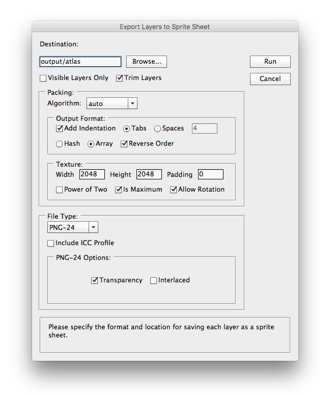

#Layer2SpriteSheet


**Layer2SpriteSheet** is a Photoshop script for generating sprite sheets from the layers in a Photoshop document file, it takes the images on all the layers and pack them together into a single larger image, while generating the coresponding metadata file with the sprite sheet information.

###Why to create just another texture packer tool?
There are some tools out there to do what **Layer2SpriteSheet** does but non of them are free and open source software. This tool is just a port of [texpack](https://github.com/urraka/texpack) to run as a Photoshop script, thanks to Mariano Cuatrin for such an amazing tool.

##Features
* Open Source ;)
* Several packing heuristics. Including one for autmatically selectng the most efficient packing.
* Add padding to each image.
* Trim the empty areas on all the images for better packing.
* Can choose to only export the visible layers.
* Can create a multiple sprite sheets if the output texture size isn't big enought.
* Can export to several image formats inluding Photoshop document files.
* All the options are saved directly in the document original file as XMP metadata.  

##Installing Layer2SpriteSheet
There are two ways of running **Layer2SpriteSheet** in Photoshop.
Unzip **Layer2SpriteSheet** to your photoshop scripts folder.

On windows:
```
c:\Program Files\Adobe\Photoshop CSsomething\Presets\Scripts
```

On a Mac:
```
/Applications/Adobe Photoshop CSsomething/Presets/Scripts
```

The next time Photoshop is started, **Layer2SpriteSheet** should appear in the File>Scripts menu as "Export Layers to Sprite Sheet".

Alternatively you can run the script without installing by extracting the contents of **Layer2SpriteSheet** somewhere, then selecting Scripts>Browse from the file menu and selecting Layer2SpriteSheet.jsx

##Quick Start Guide
The first thing to do is select the destination directory by clicking "Browse". Then you can change the options to better fit your desired results. Lastly click "Run" to run the packing process.

At the end of the process you'll see one or multiple document or image files created in the destination folder together with their corresponding metadata text files. Also the created files are keept open in Photoshop. The text files store the metadata that describes the position and size, alongside other parameters, for each sprite frame in the generated sprite sheet.

##Layer2SpriteSheet Reference Guide
* Interface Overview
* Packing options
* File type options

###Interface Overview
The **Layer2SpriteSheet** interface is split into three main parts. The destination text field is at the top of the window together with the options to export only the visile layers and to trim the empty areas on each layer. Below that are the packing options that holds three more regions, one for the algorithm to use, and the sections for the output file format and texture creation parameters. Lastly there is the settings to select the file type and its creation options.

###Packing options
At the top of this area there is an drop box control to select the algorithm for the paking heuristics.

Below that there are options to select whether to use indentation and the number of space characters to insert or whether to use tab characters instead.

Also whether to store the sprite frames data as a hash table or an array. In case that you choose to store the sprites as an array, you can also reverse the order in the array. If the array is not reversed the order will be the same as in the layers panel in the original Photoshop document. Be aware that when generating multiple packets of sprite sheets, the order in the layers is not preserved, this is because the packing algorithm tries to group the sprites in the most efficient way.

The options on the texture settings area allow you to select the texture size, width and height, the padding to add between the sprites and the sprites and the texture border. Also whether to create textures with power of two sizes, or to allow rotation. There is also an option to specify that the width and height are maximun values, so that the generated texture would have a size always smaller than those values.     

###File type options
This section holds information for the type of image file output and is function is the same that in the built in script "Export Layers to Files..." that is shipped with the Photoshop application.

###TODO
The script is hardwired with one type of data output file, allowing only to pick whether to store the sprite data as a hash table or as an array, but there will be an option to enter a custom format or to select one of a group of preset formats.

The script has only been tested on macOS, but it should be easyly modified to work on Windows. My guess is that there should be some special considerations when storing and reading files from the disk.  
